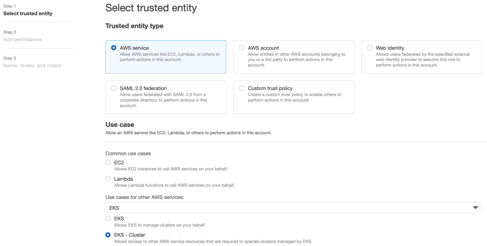
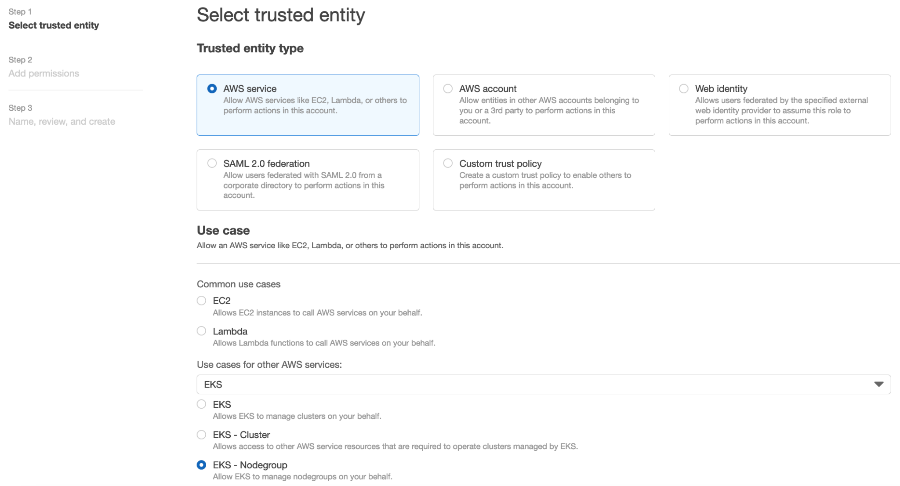
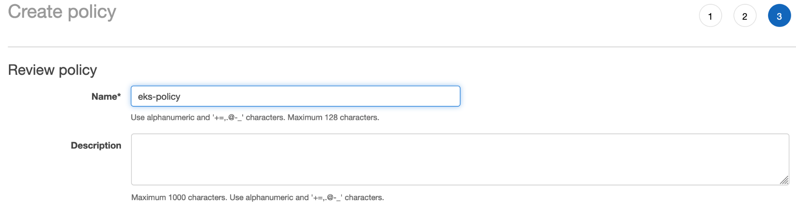
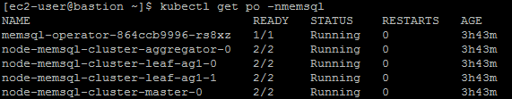

# Deploy SingleStore DB in Amazon Elastic Kubernetes Service (EKS)


# Introduction

Use these steps to deploy SingleStore DB in Amazon Elastic Kubernetes
Service (EKS)

# Summary

SingleStore's Cluster Management in kubernetes is different from native
deployment. All jobs related to cluster management are done by
operators.

Reference:
[https://docs.singlestore.com/db/v7.3/en/reference/memsql-operator-reference/memsql-operator-reference-overview.html](https://docs.singlestore.com/db/v7.3/en/reference/memsql-operator-reference/memsql-operator-reference-overview.html)

User prohibited to use below command or tools:

1.  [Cluster management command](https://docs.singlestore.com/db/v7.6/en/reference/sql-reference/cluster-management-commands/cluster-management-commands.html)

2.  SingleStore DB Toolbox except sdb-report

    a.  [sdb-toolbox-config](https://docs.singlestore.com/db/v7.6/en/user-and-cluster-administration/cluster-management-with-tools/singlestore-db-toolbox/sdb-toolbox-config.html). Performs host machine registration.

    b.  [sdb-deploy](https://docs.singlestore.com/db/v7.6/en/user-and-cluster-administration/cluster-management-with-tools/singlestore-db-toolbox/sdb-deploy.html). Installs memsqlctl and the SingleStore DB database engine to host machines in the cluster.

    c.  [sdb-admin](https://docs.singlestore.com/db/v7.6/en/user-and-cluster-administration/cluster-management-with-tools/singlestore-db-toolbox/sdb-admin.html). Helps you manage a SingleStore DB cluster.

    d.  [sdb-report](https://docs.singlestore.com/db/v7.6/en/user-and-cluster-administration/cluster-management-with-tools/singlestore-db-toolbox/sdb-report.html). Collects and performs diagnostic checks on your cluster.

    e.  [memsqlctl](https://docs.singlestore.com/db/v7.6/en/user-and-cluster-administration/cluster-management-with-tools/singlestore-db-toolbox/memsqlctl.html). Provides lower-level access to manage nodes on a host machine.

# EKS Cluster

## Prerequisite

### Role

Create two roles

#### Cluster IAM Role

Reference:
[https://docs.aws.amazon.com/eks/latest/userguide/service_IAM_role.html](https://docs.aws.amazon.com/eks/latest/userguide/service_IAM_role.html)

1.  Open the IAM console at [https://console.aws.amazon.com/iam/](https://console.aws.amazon.com/iam/)

2.  In the left navigation pane, choose **Roles**.

3.  Search the list of roles for **eksClusterRole**.
If a role that includes **eksClusterRole** doesn't exist, then continue the next step to create the role else skip the rest of steps.

4.  Click **Create role**

    

5.  **Select trusted entity**

6.  Select **AWS service**

7.  Select **EKS - Cluster** as **Use cases**

    

8. **Add permissions**

    

10. **Name, review, and create**

    

Reference:
[https://docs.aws.amazon.com/eks/latest/userguide/security-iam-awsmanpol.html](https://docs.aws.amazon.com/eks/latest/userguide/security-iam-awsmanpol.html)

Assign all \*EKS\* managed policy to the role


#### Service IAM Role

1.  Open the IAM console at [https://console.aws.amazon.com/iam/](https://console.aws.amazon.com/iam/)

2.  In the left navigation pane, choose **Roles**.

3.  Search the list of roles for **AWSServiceRoleForAmazonEKSNodegroup**.
If a role that includes **AWSServiceRoleForAmazonEKSNodegroup** doesn't exist, then continue the next step to create the role else skip the rest of steps.

4.  Click **Create role**

    

5.  **Select trusted entity**

6.  Select **AWS service**

7.  Select **EKS - Nodegroup** as **Use cases**

    

8.  **Add permissions**

    

9.  **Name, review, and create**

    

#### Node IAM Role

Reference:
[https://docs.aws.amazon.com/eks/latest/userguide/create-node-role.html](https://docs.aws.amazon.com/eks/latest/userguide/create-node-role.html)

1.  Open the IAM console at [https://console.aws.amazon.com/iam/](https://console.aws.amazon.com/iam/)

2.  In the left navigation pane, choose **Roles**.

3.  Search the list of roles for **AmazonEKSNodeRole**.
 If a role that includes **AWSServiceRoleForAmazonEKS** doesn't exist, then continue the next step to create the role else skip the rest of steps.

4.  Click **Create role**

    

5.  **Select trusted entity**

6.  Select **AWS service**

7.  Select **EC2** as **Use cases**

    

8.  **Add permissions**, select **AmazonEKSWorkerNodePolicy** and **AmazonEC2ContainerRegistryReadOnly**

    

    

9.  **Name, review, and create**

    

### Policy

1.  Open the IAM console at [https://console.aws.amazon.com/iam/](https://console.aws.amazon.com/iam/)

2.  In the left navigation pane, choose **Policies**.

3.  Click **Create Policy**.

    

4.  Copy the following aws permission on **JSON** tab

    

```json
        {
            "Version": "2012-10-17",
            "Statement": [
                {
                    "Sid": "VisualEditor0",
                    "Effect": "Allow",
                    "Action": [
                        "iam:ListRoles",
                        "ec2:DescribeSubnets",
                        "eks:CreateCluster"
                    ],
                    "Resource": "*"
                },
                {
                    "Sid": "VisualEditor1",
                    "Effect": "Allow",
                    "Action": [
                        "eks:DeleteCluster",
                        "iam:GetRole",
                        "iam:PassRole",
                        "iam:ListAttachedRolePolicies",
                        "eks:DeleteNodegroup",
                        "eks:TagResource",
                        "eks:DescribeCluster",
                        "eks:CreateNodegroup"
                    ],
                    "Resource": [
                        "arn:aws:iam::[account-id]:role/AmazonEKSNodeRole",
                        "arn:aws:iam::[account-id]:role/eksClusterRole",
                        "arn:aws:iam::[account-id]:role/*AWSServiceRoleForAmazonEKSNodegroup",
                        "arn:aws:eks:us-east-1:[account-id]:nodegroup/eks-cluster/*/*",
                        "arn:aws:eks:us-east-1:[account-id]:cluster/eks-cluster"
                    ]
                }
            ]
        }
```

5.  **Review policy**, put name **eks-policy**

    

### User

Create user service

1.  Open the IAM console at [https://console.aws.amazon.com/iam/](https://console.aws.amazon.com/iam/)

2.  In the left navigation pane, choose **Users**.

3.  Set user details

4.  Select **Access key - Programmatic access** only

    

5.  **Add permission**

6.  Choose **Attach existing policies directly**.

    Attach **eks-policy** to users.

    

## Create the Cluster

Reference:
[https://docs.aws.amazon.com/eks/latest/userguide/create-cluster.html#aws-cli](https://docs.aws.amazon.com/eks/latest/userguide/create-cluster.html#aws-cli)

1.  Define
```
region-code
cluster-name
account_id
subnetId
```
2.  Create cluster

    Use comma as delimiter if you have more than one subnet

    Create your cluster with the following command:

        aws eks create-cluster \
        --region region-code \
        --name cluster-name \
        --kubernetes-version 1.21 \
        --role-arn arn:aws:iam::\[account-id\]:role/eksClusterRole \
        --resources-vpc-config subnetIds=subnetId1,subnetId2

    

    This process may take several minutes.

## Access the Cluster

Connect kubectl

    aws eks update-kubeconfig --region us-east-1 --name eks-cluster

Verify

    kubectl get node -o wide

  

## Delete VPC CNI

Reference:
[https://docs.cilium.io/en/v1.9/gettingstarted/k8s-install-eks/](https://docs.cilium.io/en/v1.9/gettingstarted/k8s-install-eks/)

Cilium will manage ENIs instead of VPC CNI, so the aws-node DaemonSet
has to be deleted to prevent conflict behavior.

    kubectl -n kube-system delete daemonset aws-node


Wait the cluster creation complete if you above result


You can continue to the next step using kubectl command

## Deploy Cilium as CNI

Reference:
[https://docs.cilium.io/en/v1.9/gettingstarted/k8s-install-eks/#deploy-cilium](https://docs.cilium.io/en/v1.9/gettingstarted/k8s-install-eks/#deploy-cilium)

Setup Helm repository:

    helm repo add cilium https://helm.cilium.io/

This helm command sets eni=true and tunnel=disabled, meaning the Cilium
will allocate a fully-routable AWS ENI IP address for each pod, similar
to the behavior of the [Amazon VPC CNI
plugin](https://docs.aws.amazon.com/eks/latest/userguide/pod-networking.html).

Excluding the lines for eni=true, ipam.mode=eni and tunnel=disabled from
the helm command will configure Cilium to use overlay routing mode.
Ensure the pod CIDR (ipam.operator.clusterPoolIPv4PodCIDR) is not
overlapping with node CIDR.

Deploy Cilium release via Helm:

    helm install cilium cilium/cilium --version 1.9.13 \
    --namespace kube-system \
    --set eni=true \
    --set ipam.mode=eni \
    --set egressMasqueradeInterfaces=eth0 \
    --set tunnel=disabled \
    --set nodeinit.enabled=true

## Create the Node Group

Reference:
[https://docs.aws.amazon.com/eks/latest/userguide/create-cluster.html#aws-cli](https://docs.aws.amazon.com/eks/latest/userguide/create-cluster.html#aws-cli)

1.  Define
`region-code`
`cluster-name`
`account_id`
`subnetId`

2.  Create node group

    Use space as delimiter if you have more than one subnet

    Create node group with the following command:
```console
        aws eks create-nodegroup \
        --cluster-name cluster-name \
        --region region-code \
        --nodegroup-name ng-1 \
        --scaling-config minSize=1,maxSize=2,desiredSize=1 \
        --instance-types t2.large \
        --subnets subnetId1 subnetId2 \
        --node-role arn:aws:iam::\[accountId\]:role/AmazonEKSNodeRole
```
    

    This process may take several minutes.

## Verification

1.  Ensure the node's status is Ready and all pod's status Running.

        kubectl get nodes

        kubectl get po -A

    

2.  In cilium operator logs show Initialization complete

        kubectl logs \[cilium-operator-pod-name\] -nkube-system --tail 10

    


# SingleStore

## Cluster Admin Prerequisites

1.  Determine the project (namespace) in which to deploy SingleStore DB.

2.  Determine which StorageClass (SC) to use.

    Avoid using a StorageClass with an NFS-based provisioner. Ideally, you should choose a StorageClass that uses a block storage-based provisioner that supports volume expansion and the WaitForFirstConsumer binding mode.

    Available SC in EKS:

    

3.  Determine the fsGroup to use for the deployment.

## Deployment Prerequisites

1.  Obtain a SingleStore license from the [SingleStore Customer Portal](https://portal.singlestore.com).

2.  Select the SingleStore DB images to use. Two Docker images are required for the deployment.

    a.  The node image is the SingleStore DB database engine and can be found [on Docker Hub](https://hub.docker.com/r/memsql/node/tags).

    b.  The Operator image is used to manage the SingleStore DB engine deployment in Kubernetes environment, and can also be found [on Docker Hub](https://hub.docker.com/r/memsql/operator/tags).

3.  Use the StorageClass that you selected in *Cluster Admin Prerequisites.*

4.  Substitute the fsGroup value with the value you copied in *Cluster Admin Prerequisites.*

## Create the Object Definition Files

The following are definition files that will be used by the Operator to
create your cluster. Create new definition files and copy and paste the
contents of each code block into those files.

-   [deployment.yaml](https://docs.singlestore.com/db/v7.6/en/deploy/kubernetes/create-the-object-definition-files/deployment-yaml.html)

-   [rbac.yaml](https://docs.singlestore.com/db/v7.6/en/deploy/kubernetes/create-the-object-definition-files/rbac-yaml.html)

-   [memsql-cluster-crd.yaml](https://docs.singlestore.com/db/v7.6/en/deploy/kubernetes/create-the-object-definition-files/memsql-cluster-crd-yaml.html)

-   [memsql-cluster.yaml](https://docs.singlestore.com/db/v7.6/en/deploy/kubernetes/create-the-object-definition-files/memsql-cluster-yaml.html)


### MemSQL Operator

For --cluster-id, enter the name of your cluster. This will be the name used in the memsql-cluster.yaml file as per:

    metadata:
        name: memsql-cluster

Create a deployment definition file using the template below.

    cat > deployment.yaml <<EOF
    apiVersion: apps/v1
    kind: Deployment
    metadata:
    name: memsql-operator
    spec:
    replicas: 1
    selector:
    matchLabels:
      name: memsql-operator
    template:
    metadata:
      labels:
        name: memsql-operator
    spec:
      serviceAccountName: memsql-operator
      containers:
        - name: memsql-operator
          image: memsql/operator:1.2.5-83e8133a
          imagePullPolicy: Always
          args:
            - "--cores-per-unit"
            - "8"
            - "--memory-per-unit"
            - "32"
            - "--merge-service-annotations"
            - "--cluster-id"
            - "memsql-cluster"
            - "--fs-group-id"
            - "5555"
          env:
            - name: WATCH_NAMESPACE
              valueFrom:
                fieldRef:
                  fieldPath: metadata.namespace
            - name: POD_NAME
              valueFrom:
                fieldRef:
                  fieldPath: metadata.name
            - name: OPERATOR_NAME
              value: memsql-operator
            - name: RELATED_IMAGE_BACKUP
              value: memsql/tools
    EOF


### RBAC

Copy the following to create a ServiceAccount definition file that will
be used by the MemSQL Operator.

    cat > rbac.yaml <<EOF
    apiVersion: v1
    kind: ServiceAccount
    metadata:
      name: memsql-operator
    ---
    apiVersion: rbac.authorization.k8s.io/v1
    kind: Role
    metadata:
      name: memsql-operator
    rules:
    - apiGroups:
      - ""
      resources:
      - pods
      - services
      - endpoints
      - persistentvolumeclaims
      - events
      - configmaps
      - secrets
      verbs:
      - '*'
    - apiGroups:
      - policy
      resources:
      - poddisruptionbudgets
      verbs:
      - '*'
    - apiGroups:
      - batch
      resources:
      - cronjobs
      verbs:
      - '*'
    - apiGroups:
      - ""
      resources:
      - namespaces
      verbs:
      - get
    - apiGroups:
      - apps
      - extensions
      resources:
      - deployments
      - daemonsets
      - replicasets
      - statefulsets
      - statefulsets/status
      verbs:
      - '*'
    - apiGroups:
      - memsql.com
      resources:
      - '*'
      verbs:
      - '*'
    - apiGroups:
      - networking.k8s.io
      resources:
      - networkpolicies
      verbs:
      - '*'
    - apiGroups:
      - coordination.k8s.io
      resources:
      - leases
      verbs:
      - get
      - list
      - watch
      - create
      - update
      - patch
      - delete
    ---
    kind: RoleBinding
    apiVersion: rbac.authorization.k8s.io/v1
    metadata:
      name: memsql-operator
    subjects:
    - kind: ServiceAccount
      name: memsql-operator
    roleRef:
      kind: Role
      name: memsql-operator
      apiGroup: rbac.authorization.k8s.io
    EOF


### Custom Resource Definition

1.  Update apiVersion from v1alpha to v1

2.  Restructure the spec

3.  Create the CRD file use following command

        cat > memsql-cluster-crd.yaml <<EOF
        apiVersion: apiextensions.k8s.io/v1
        kind: CustomResourceDefinition
        metadata:
          name: memsqlclusters.memsql.com
        spec:
          group: memsql.com
          names:
            kind: MemsqlCluster
            listKind: MemsqlClusterList
            plural: memsqlclusters
            singular: memsqlcluster
            shortNames:
              - memsql
          scope: Namespaced
          versions:
            - name: v1alpha1
              served: true
              storage: true
              schema:
                openAPIV3Schema:
                  type: object
                  x-kubernetes-preserve-unknown-fields: true
              additionalPrinterColumns:
              - name: Aggregators
                type: integer
                description: Number of SingleStore DB Aggregators
                jsonPath: .spec.aggregatorSpec.count
              - name: Leaves
                type: integer
                description: Number of SingleStore DB Leaves (per availability group)
                jsonPath: .spec.leafSpec.count
              - name: Redundancy Level
                type: integer
                description: Redundancy level of SingleStore DB Cluster
                jsonPath: .spec.redundancyLevel
              - name: Age
                type: date
                jsonPath: .metadata.creationTimestamp
        EOF


### MemSQL Cluster

Create a MemSQLCluster definition file to specify the configuration settings for your cluster.

    cat > memsql-cluster.yaml <<EOF
    apiVersion: memsql.com/v1alpha1
    kind: MemsqlCluster
    metadata:
      name: memsql-cluster
    spec:
      # TODO: paste your license key from https://portal.singlestore.com here:
      license: REPLACE_THIS_WITH_LICENSE

      # TODO: replace the default admin password for production environment
      # select password("secret");
      adminHashedPassword: "*14E65567ABDB5135D0CFD9A70B3032C179A49EE7"
      nodeImage:
        repository: memsql/node
        tag: latest

      # TODO: set greater than 1 to enable HA mode
      redundancyLevel: 1
      serviceSpec:
        objectMetaOverrides:
          labels:
            custom: label
          annotations:
            custom: annotations
      aggregatorSpec:
        count: 1
        height: 0.25
        storageGB: 20
        storageClass: default
        objectMetaOverrides:
          annotations:
            optional: annotation
          labels:
            optional: label
      leafSpec:
        count: 1
        height: 0.25
        storageGB: 20
        storageClass: default
        objectMetaOverrides:
          annotations:
            optional: annotation
          labels:
            optional: label
    EOF


## Deploy a SingleStore DB Cluster

Reference: [Deploy a SingleStore DB Cluster](https://docs.singlestore.com/db/v7.3/en/deploy/kubernetes/deploy-a-singlestore-db-cluster.html)

Now that your various object definition files are created, you will use kubectl to do the actual object creation and cluster deployment.

1.  Install the RBAC resources.

        kubectl create -f rbac.yaml -n<namespace>

2.  Install the MemSQL cluster resource definition.

        kubectl create -f memsql-cluster-crd.yaml

3.  Deploy the Operator.

        kubectl create -f deployment.yaml -n<namespace>

4.  Verify the deployment was successful by checking the status of the pods in your Kube cluster. You should see the Operator with a status of Running.

        kubectl get pods

5.  Finally, create the cluster.

        kubectl create -f memsql-cluster.yaml

6.  After a couple minutes, run kubectl get pods again to verify the aggregator and leaf nodes all started and have a status of Running.

        kubectl get pods

    If you see no pods are in the Running state, check the Operator logs by running

        kubectl logs deployment memsql-operator -n<namespace>

    Then look at the various objects to see what is failing.

## Verification

1.  Verify the cluster

        kubectl get memsqlcluster memsql-cluster -o=jsonpath='{.status.phase}{"\n"}' -n<name-space>

        The SingleStore DB server deployment is complete when Running is displayed after running the above commands.

2.  Verify the pod list, run the following command to display the pod list.

        kubectl get po -n<name-space>

        Result may vary:

    

3.  After the deployment completes, run the following command to display the two SingleStore DB service endpoints that are created during the deployment.

        kubectl get svc | grep <cluster-name>

    The svc-<cluster-name>-ddl and svc-<cluster-name>-dml service endpoints can be used to connect to SingleStore DB using a MySQL compatible client. Note that svc-<cluster-name>-dml only exists if memsqlCluster.aggregatorSpec.count is greater than 1.

    The output will resemble the following (actual values will vary):

        NAME TYPE CLUSTER-IP EXTERNAL-IP PORT(S) AGE
        svc-memsql-cluster ClusterIP None <none> 3306/TCP 44h
        svc-memsql-cluster-ddl LoadBalancer 10.101.189.86 169.46.26.10
        3306:30351/TCP 44h
        svc-memsql-cluster-dml LoadBalancer 10.103.29.220 169.46.26.11
        3306:32524/TCP 44h
        svc-memsql-studio LoadBalancer 10.97.104.121 169.46.26.11 8081:31161/TCP
        43h

    Column definition:

        NAME EXTERNAL-IP PORT(S) AGE
        Service name External IP Service Port:Node Port Service created

    Refer to [Data Definition Language DDL](https://docs.singlestore.com/db/v7.3/en/reference/sql-reference/data-definition-language-ddl/data-definition-language-ddl.html) and [Data Manipulation Language DML](https://docs.singlestore.com/db/v7.3/en/reference/sql-reference/data-manipulation-language-dml/data-manipulation-language-dml.html) for more information.


## Install SingleStore Client

1.  Add the SingleStore repository to your repository list.

        sudo yum-config-manager --add-repo https://release.memsql.com/production/rpm/x86_64/repodata/memsql.repo

2.  Verify that the SingleStore repo information is listed under repolist.

        sudo yum repolist

3.  Verify that the which package is installed. This is used during the install process to identify the correct package type for your installation.

        rpm -q which

4.  Install which
    Skip this step if you have it

        sudo yum install -y which

5.  Install the SingleStore client.

        sudo yum install -y singlestore-client

## Access SingleStore DB

1.  Connect via Load Balancer / External IP (refer svc-memsql-cluster-ddl endpoint)

        singlestore -u admin -h <external-ip> -p

    

2.  Connect via Node Port (refer svc-memsql-cluster-ddl endpoint)
    In case the External-IP is pending, we can access through Node Port Get the host IP of singlestore's master node:

        kubectl get po node-memsql-cluster-master-0 -n<namespace> -o=jsonpath='{.status.hostIP}{"\n"}'

    Sample output: 172.31.21.171

        singlestore -u admin -h <host-ip> -P <node-port> -p

    

3.  Check status of aggregator and leaf, run the following command

        show aggregators;

        show leaves;

    The result may vary:

    


# Rollback/Cleanup

## EKS Cluster

Skip this step if you want to retain the EKS cluster for another
application
### Node Group
```
aws eks delete-nodegroup \
--cluster-name cluster-name \
--region region-code \
--nodegroup-name ng-1
```
### Cluster
```
aws eks delete-cluster \
  --region region-code \
  --name cluster-name
```
## SingleStore DB

This step is no longer required if you did the previous step (delete EKS cluster).
 
1. Delete the cluster.
``` 
kubectl delete -f memsql-cluster.yaml -n<namespace>
```
2. Clean up the PersistentVolumeClaim
```
kubectl delete pvc --all -n<namespace>
```
3. Delete the Operator.
```
kubectl delete -f deployment.yaml -n<namespace>
```
4. Delete RBAC
```
kubectl create -f rbac.yaml -n<namespace>
```
5. Delete the MemSQL custom resource definition.
```
kubectl create -f memsql-cluster-crd.yaml
```
6. Clean up the Namespaces
```
kubectl delete ns <namespaces>
```

# Useful Command

## Kubernetes

Kubernetes object

    statefulsets, deployment, pod, memsqlcluster, pvc, pv

kubectl command:

Go to inside pod:

    kubectl exec -it \[pod name\] -n <namespace> -- bash

Other:

    kubectl get statefulsets

    kubectl get deploy -n memsql

    kubectl describe deploy \[deployment name\] -n memsql

    kubectl get pod -n memsql

    kubectl describe pod \[pod name\] -n memsql

    kubectl get memsqlcluster -n memsql

    kubectl describe memsqlcluster \[memsqlcluster name\] -n memsql

    kubectl get pvc -n memsql

    kubectl describe pvc \[pvc name\] -n memsql

    kubectl get pv -n memsql

    kubectl describe pv \[pv name\] -n memsql

    kubectl logs \[pod name\] -n memsql

    kubectl logs -f \[pod name\] -n<namespace>

## SingleStore

singlestore command need to run inside the master pod:

Check license:

    memsqlctl show-license

List MemSQL Nodes on the local machine:

    memsqlctl list-nodes

List aggregator node:

    memsqlctl show-aggregators

List leaves node:

    memsqlctl show-leaves